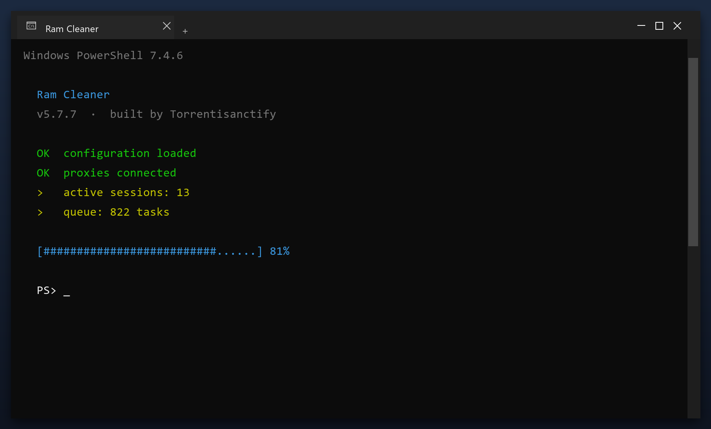

# Ram Cleaner — Latest Version Free Download (2026)

 

**Ram cleaner** is a Windows utility that keeps your PC clean and running fast. It is the current 2026 build, tested on Windows 10 and 11. **Free. No registration. No bundled adware.**

| | |
| --- | --- |
| **Program** | Ram Cleaner |
| **Version** | Latest 2026 build |
| **Price** | Free |
| **Systems** | see requirements below |
| **Download** | Quick Start section below |

## Is this tool safe?

| **Problem** | **Solution** |
| --- | --- |
| **Long boot time** | Trim the startup list |
| **Random crashes** | Fix broken registry links |
| **Full temp folder** | Clear caches in one pass |
| **Slow in games** | Stop background tasks |
| **Unknown files** | See exactly what is safe to remove |

## Does it really work?

- **Low free space** - junk files quietly eat your disk
- **Unstable system** - leftover entries cause freezes and errors
- **Manual work** - cleaning by hand takes hours
- **Unsafe downloads** - fake tools are everywhere
- **Confusing options** - most tools are hard to understand

  

  

## How do I install it?

1. **Download** the tool with the button below
2. **Extract** the archive (WinRAR or 7-Zip)
3. **Run** the program as administrator
4. **Scan** - wait for the scan to finish
5. **Fix** - review the results and press the repair button

> **Note:** make sure your work is saved before a deep clean. The tool creates a restore point, but saving first is always wise.

## What will I get?

| **Component** | **Details** |
| --- | --- |
| **Main tool** | Latest 2026 build |
| **Guide** | Step-by-step setup |
| **FAQ** | Common questions |
| **Support** | Via the issues section |

## What does it need?

| **Component** | **Requirement** |
| --- | --- |
| **Operating system** | Windows 10 or 11 (64-bit) |
| **RAM** | 2 GB or more |
| **Free disk space** | 100 MB |
| **Permissions** | Administrator (for some tasks) |

## More questions

**Do I need to be technical?**

No. It shows plain buttons and a clear report - no settings to understand.

**Will it slow my PC while running?**

Only during a scan. It throttles itself when you are using the computer.

**Does it run in the background?**

No. It only works when the window is open.

**Can I undo a cleanup?**

Yes - a restore point is created before any change.

**Is there a paid version?**

No. Everything is included and free.

## Notes

- Empty the Recycle Bin first for a clearer picture
- Uninstall programs you no longer use before scanning
- Close browsers so their caches can be cleared
- Save your work before a full cleanup
- Reboot once the cleanup is done

---

*swift-brook-888 · Updated 2026-10-09 · Shared under the MIT License*
